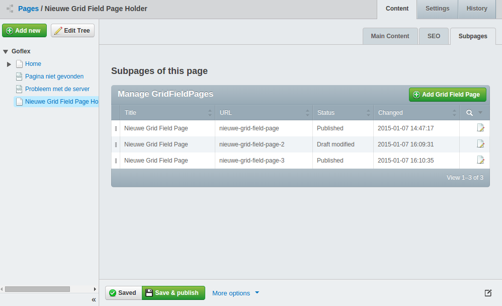

Extension to hide pages from the SiteTree
=========================================

This extension hides pages from the sitetree

## Features

  * Configurable subpage classes (children) to be hidden under parent page in the sitetree

## Requirements

 * SilverStripe 3.0 or newer


## Screenshot
*Hide SiteTree items from from the sitetree (and manage them from a GridField):*



## Installation

```
composer require micschk/silverstripe-excludechildren dev-master
```

## Usage

In config.yml:

	SubPageHolder:
	  extensions:
		- 'ExcludeChildren'
	  excluded_children:
		- 'SubPage'
		- 'AnotherPageType'

Or in your Page class (php):

	class SubPageHolder extends Page {
		...
		static $extensions = array("ExcludeChildren");
		static $excluded_children = array('SubPage', 'AnotherPageType_Extending_Page');
		...

Or externally via _config.php:

		Object::add_extension("SubPageHolder", "ExcludeChildren");
		Config::inst()->update("SubPageHolder", "excluded_children", array("BlogEntry"));

Then, add a GridField instead to create/edit subpages

	$gridFieldConfig = GridFieldConfig::create()->addComponents(
		new GridFieldToolbarHeader(),
		new GridFieldAddNewButton('toolbar-header-right'),
		new GridFieldSortableHeader(),
		new GridFieldDataColumns(),
		new GridFieldPaginator(20),
		new GridFieldEditButton(),
		new GridFieldDeleteAction(),
		new GridFieldDetailForm()
	);
	$gridField = new GridField("SubPages", "SubPages of this page", 
			$this->SubPages(), $gridFieldConfig);
	$fields->addFieldToTab("Root.SubPages", $gridField);

## Pro tip

Add GridfieldSitetreebuttons to your gridfieldconfig to edit the pages in their regular edit forms:
* silverstripe-gridfieldsitetreebuttons (https://github.com/micschk/silverstripe-gridfieldsitetreebuttons)

Or use/subclass the preconfigured GridfieldPages module, which contains both excludechildren and sitetreebuttons:
* silverstripe-gridfieldpages (https://github.com/micschk/silverstripe-gridfieldpages)